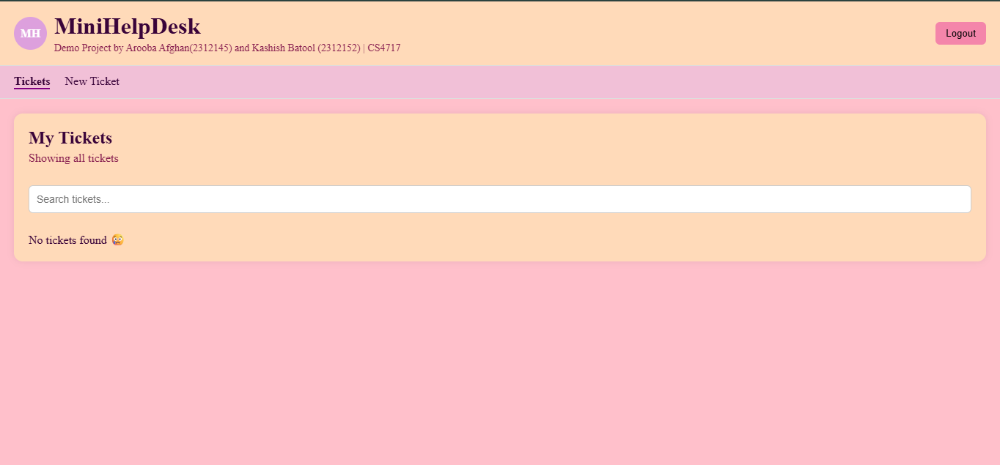
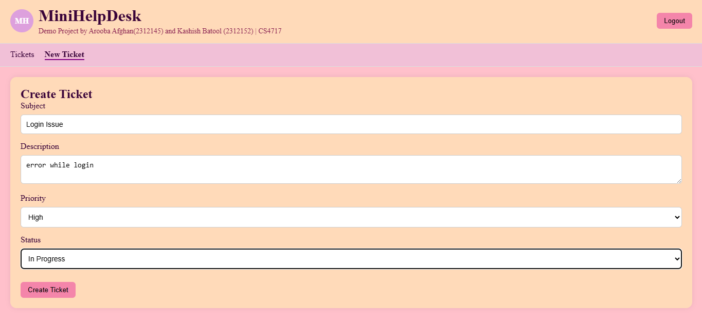

---

# MiniHelpDesk – Full Stack Ticket Management System

**Course:** CSC 4717 – Web Technologies-I
**Student:** Arooba Afghan (2312145)

## Project Overview

MiniHelpDesk is a full-stack ticket management application developed as part of the CSC 4717 Web Technologies-I course project.

The application allows users to create, view, search, update, and delete support tickets through a React-based frontend while storing data persistently in MongoDB Atlas through an Express.js backend API.

## Demo Video
https://drive.google.com/file/d/1wI-gjx9H6XD2LtaJJbrmX7wIu6_IPm7Y/view?usp=sharing
---
# Screenshots

## Image 1


## Image 2

## Features

### Core Features

* Create support tickets
* View all tickets
* Edit existing tickets
* Delete tickets
* Store tickets in MongoDB Atlas
* REST API integration

### Additional Features

#### Product Feature: Search Tickets

Users can search tickets by subject or description.

#### Engineering Quality Feature: Empty State Design

When no tickets exist, the application displays a helpful message instead of showing a blank page.

---

## Technology Stack

### Frontend

* React
* TypeScript
* React Router
* Vite
* CSS

### Backend

* Node.js
* Express.js
* TypeScript

### Database

* MongoDB Atlas
* Mongoose

### Development Tools

* Git & GitHub
* ESLint
* Prettier

---

## Project Structure

```text
webtech1-frontend-starter
│
├── backend
│   ├── src
│   │   ├── config
│   │   ├── controllers
│   │   ├── models
│   │   ├── routes
│   │   ├── app.ts
│   │   └── server.ts
│   │
│   ├── package.json
│   ├── tsconfig.json
│   └── .env
│
├── src
│   ├── components
│   ├── pages
│   ├── services
│   ├── types
│   └── App.tsx
│
├── public
├── package.json
└── README.md
```

---

## Prerequisites

Install the following software before running the project:

### Required Software

* Node.js (LTS)

  * [https://nodejs.org](https://nodejs.org)

* Git

  * [https://git-scm.com](https://git-scm.com)

* VS Code

  * [https://code.visualstudio.com](https://code.visualstudio.com)

* MongoDB Atlas Account

  * [https://www.mongodb.com/cloud/atlas](https://www.mongodb.com/cloud/atlas)

---

## Verify Installation

Open PowerShell and run:

```bash
node -v
npm -v
git --version
```

---

## Installation

### Clone Repository

```bash
git clone <repository-url>
cd webtech1-frontend-starter
```

---

# Backend Setup

Navigate to backend folder:

```bash
cd backend
```

Install dependencies:

```bash
npm install
```

Create a `.env` file:

```env
PORT=5000
MONGO_URI=your_mongodb_connection_string
```

Start backend server:

```bash
npm run dev
```

Expected output:

```text
Server running on port 5000
MongoDB Connected
```

---

# Frontend Setup

Open a second terminal:

```bash
cd webtech1-frontend-starter
```

Install dependencies:

```bash
npm install
```

Run frontend:

```bash
npm run dev
```

Expected output:

```text
Local: http://localhost:5173
```

Open the URL in your browser.

---

## API Endpoints

### Get All Tickets

```http
GET /tickets
```

### Create Ticket

```http
POST /tickets
```

### Update Ticket

```http
PUT /tickets/:id
```

### Delete Ticket

```http
DELETE /tickets/:id
```

---

## Available Commands

### Frontend

```bash
npm run dev
npm run build
npm run preview
npm run lint
```

### Backend

```bash
npm run dev
```

---

## Testing

The application was tested using:

* Browser testing
* MongoDB Atlas
* Postman
* React Developer Tools

---

## Learning Outcomes

This project demonstrates:

* React component development
* State management using React Hooks
* React Router navigation
* REST API development with Express.js
* MongoDB database integration
* CRUD operations
* TypeScript usage in frontend and backend
* Full-stack application development
* Git and GitHub workflow

---

## Author

**Arooba Afghan** and **Kashish Batool**
Student ID: **2312145** and **2312152**
CSC 4717 – Web Technologies-I

---

## Acknowledgement

This project was developed using the official CSC 4717 Web Technologies-I frontend starter template and extended into a full-stack application using React, Express.js, MongoDB Atlas, and TypeScript.

---

